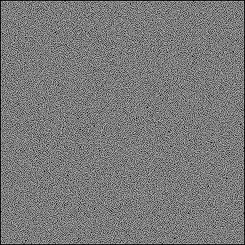
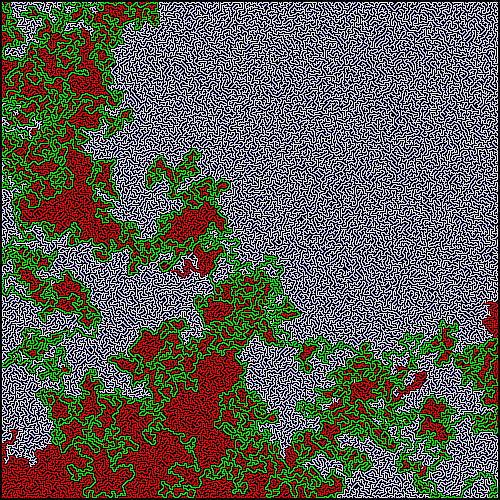

### A maze solver written in Rust that can solve relatively simple (but potentially large) mazes.

The maze is first read from a file, with traversal pixels turned 
into graph nodes. Only optimal nodes are selected during this conversion.
This potentially reduces the time and space complexity by a significant
factor.

Once the image is converted into an undirected graph with weighted edges, 
the A* search algorithm is used to find a path from the start of the maze to
the end, using the reverse manhattan distance as the heuristic.  This provides
a quite optimal traversal of the maze, and unless there is backtracking in the
maze it is very optimal in finding the correct path without too many incorrect
branches.

Once it finds the proper path, it creates an output image containing that path
in green pixels. It also will draw the visited locations and display them as 
red pixels.

### Why?
Got bored and this seemed like a fun project to me (it was).

### Example with 500x500 pixel input
Input:

Output:

